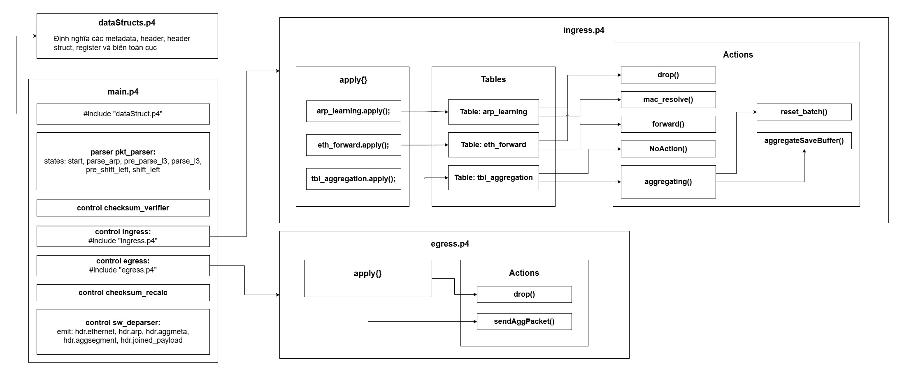

# Switch P4 xử lý tổng hợp gói tin

## Giới thiệu

Đây là switch SDN (trong bài viết này sẽ gọi tắt là "switch") với lớp dữ liệu lập trình được. Ngôn ngữ P4 được sử dụng để viết chương trình. Chương trình sẽ được biên dịch thành Data plane configuration (dạng file JSON) trước khi đuọc nạp vào switch.

\***Chú thích**: Data plane configuration (còn gọi là Data plane runtime) là một tệp JSON miêu tả các logic chuyển tiếp cho lớp dữ liệu của switch. File này chứa đồ thị parse (đối với parser-deparser) và các bảng match-action (đối với các control ingress và egress).

## Cấu trúc tệp của chương trình

- `main.p4`: Tệp P4 chính, chứa chương trình P4.
- `dataStructs.p4`: Tệp P4 phụ, chứa định nghĩa các cấu trúc dữ liệu (struct), header, register và hằng số toàn cục được sử dụng trong chương trình. Sẽ được bao gồm trong `main.p4` qua chỉ thị tiền xử lý `#include`.
- `ingress.p4`: Tệp P4 phụ, chứa các đoạn mã được đặt trong khối điều khiển xử lý gói tin ở hướng vào (ingress). Sẽ được bao gồm trong `main.p4` qua chỉ thị tiền xử lý `#include`.
- `egress.p4`: Tệp P4 phụ, chứa các đoạn mã được đặt trong khối điều khiển xử lý gói tin ở hướng ra (egress). Cũng sẽ được bao gồm trong `main.p4` qua chỉ thị tiền xử lý `#include`.
- `macros/loop_unroll.p4`: Tệp P4 chứa định nghĩa macro để thay thế các đoạn mã được viết lặp lại nhiều lần bằng một macro duy nhất. Lý do cho việc này là vì P4 không hỗ trợ vòng lặp (sẽ báo lỗi ngay khi biên dịch).

## Luồng include file và gọi hàm trong chương trình

## Luồng hoạt động của chương trình

Một switch P4 theo kiến trúc V1Model, khi cho gói tin đi qua sẽ gồm các khối sau:

Parser -> Ingress -> Packet Buffer Engine -> Egress -> Deparser

### Parser

Parser sẽ nhận gói tin vào đưa dữ liệu vào các cấu trúc kiểu "header" đã được định nghĩa trong `dataStructs.p4`.

Parser bao gồm các state (trạng thái). Mỗi state gồm các lệnh và kết thúc bằng transition (chuyển trạng thái). Lệnh sẽ được thực thi tuần tự, sau đó sẽ chuyển sang trạng thái tiếp theo dựa trên transition. Có thể sử dụng select để chuyển sang state tiếp theo dựa trên điều kiện. Các state của parser:

- `start`: Trạng thái bắt đầu, trích xuất Ethernet header (hdr.ethernet) từ đầu gói tin. Nếu ethertype (hdr.ethernet.etherType) là IPv4, sẽ chuyển sang state `pre_parse_l3`. Nếu ethertype là ARP, sẽ chuyển sang state `parse_arp`. Mặc định sẽ chuyển sang state `accept` (chấp nhận gói tin, kết thúc parser).

- `parse_arp`: Trạng thái parse ARP header (hdr.arp). Sau khi parse xong sẽ chuyển sang state `accept`.

- `pre_parse_l3`: Để tổng hợp các đoạn payload của gói tin, cần lưu payload vào register. Để làm vậy, cần parse payload vào một cấu trúc tương tự header để chương trình P4 có thể đọc và xử lý. Do các gói tin có thể có độ dài payload khác nhau, cần lookahead (xem trước) 16 bit cuối của 32 bit đầu tiên của payload để xác định độ dài payload (ở state tiếp theo, payload sẽ được parse từng byte một). (`mta.segLen = pkt.lookahead<bit<32>>()[15:0];`). Nếu độ dài payload (mta.segLen) lớn hơn 0, sẽ chuyển sang state `parse_l3`. Nếu độ dài payload bằng 0, sẽ ngưng parse và chuyển sang state `accept` (đúng ra phải là `reject`, nhưng kiến trúc của BMv2 không hỗ trợ trạng thái này khi parse).

- `parse_l3`: Trạng thái parse payload ethernet vào mảng `hdr.original_payload`. Payload sẽ được parse từng byte một (do P4 không hỗ trợ vòng lặp, nên phải viết lặp lại đoạn mã parse byte này nhiều lần) cho đến khi độ dài còn lại của payload (được sao chép từ `mta.segLen` vào biến `tmpLength` ở cuối trạng thái `pre_parse_l3`) bằng 0. Một metadata `mta.payload_data` được sử dụng để ghép các byte đã parse thành một đoạn payload hoàn chỉnh (tối đa 40 byte). Với mỗi một byte được parse, giá trị `mta.payload_data` sẽ được dịch trái 8 bit và sử dụng phép OR với byte mới parse để ghép byte mới vào cuối metadata `mta.payload_data`. Sau khi parse xong payload, sẽ chuyển sang state `pre_shift_left`.

- `pre_shift_left`: Trạng thái này được sử dụng để chuẩn bị cho việc dịch trái (shift left) đoạn payload trong metadata `mta.payload_data` lên đầu không gian bit. Việc này là cần thiết, vì trong trường hợp gói tin không được tổng hợp mà được gửi thẳng dưới dạng gói tin bình thường, payload cần bắt đầu ngay sau header. Việc để parser ở cuối giá trị sẽ tạo khoảng trống (chuỗi toàn bit 0) giữa header và payload thực khi deparse, làm sai lệch dữ liệu gói tin gửi đi.

- `shift_left`: Trạng thái này sẽ dịch trái (shift left) đoạn payload trong metadata `mta.payload_data` lên đầu không gian bit. Số lần thực hiện dịch trái chính là giá trị `leftShiftAmount` (giá trị này được tính trong trạng thái `pre_parse_l3` bằng cách lấy 40 (byte) trừ đi kích thước payload chuẩn bị parse). Việc dịch trái được lặp lại theo từng byte một (dịch 8 bit) và sẽ trừ đi 1 trên giá trị `leftShiftAmount`. Khi `leftShiftAmount` bằng 0, sẽ chuyển sang state `accept`.

### Ingress

Ingress sẽ xử lý gói tin sau khi đã được parser trích xuất vào các header. Do mã nguồn dài, đoạn mã bên trong khối control ingress sẽ được viết trong tệp `ingress.p4` và được bao gồm vào `main.p4` qua chỉ thị tiền xử lý `#include`. Trong khối điều khiển, các bảng (`table`) và hành động (`action`) (hành động về cơ bản giống như thủ tục hoặc hàm) có thể được định nghĩa. Tuy nhiên, chương trình chỉ thực hiện những gì được viết trong khối `apply` (một khối con nằm trong khối điều khiển). Trong khối `apply`, người dùng có thể gọi phương thức `<table>.apply()` để một bảng được áp dụng cho gói tin, hoặc gọi thẳng một hành động (`<action>()`) để thực thi. Để có thể gọi các bảng hoặc hành động trong khối `apply`, cần định nghĩa chúng trước khi định nghĩa khối `apply`. Như vậy, luồng ingress sẽ bắt đầu thực thi từ dòng 185 của file `ingress.p4`.

#### Các bảng và hành động trong ingress

- **`action drop()`**: Hành động này sẽ đánh dấu gói tin để bị drop (bỏ) ở khối egress. Đây là wrapper cho thủ tục `mark_to_drop(std_meta)` có sẵn trong P4 để không cần phải truyền tham số mỗi lần gọi. Việc truyền standard metadata vào mỗi lần gọi thủ tục `mark_to_drop` khá bất tiện (đặc biệt khi đưa vào bảng và truyền đầu mục vào bảng từ control plane) và không quá cần thiết.

- **`action mac_resolve(macAddr_t resolved_mac)`**: Hành động này sẽ gán địa chỉ MAC đã được phân giải (được truyền vào dưới dạng tham số `resolved_mac`) vào trường `hdr.arp.src_mac` của header ARP và trường `hdr.ethernet.srcAddr` của header Ethernet, sửa giá trị `hdr.arp.op_code` thành 2 (reply) để gửi lại máy tính đã yêu cầu.

- **`table arp_learning`**: Bảng này sẽ đọc địa chỉ IP nguồn từ header ARP (trường `hdr.arp.src_ip`). Nếu địa chỉ IP này nằm trong một đầu mục của bảng, sẽ thực thi hành động `mac_resolve` với tham số là địa chỉ MAC tương ứng đã được lưu trong bảng. Nếu địa chỉ IP này không nằm trong bất kỳ đầu mục nào của bảng, sẽ thực thi hành động mặc định là `drop` để bỏ gói tin.

- **`action forward(egressSpec_t port)`**: Hành động này sẽ gán giá trị `port` (được truyền vào dưới dạng tham số) vào trường `std_meta.egress_spec` của metadata chuẩn để chỉ định cổng ra (cổng logic trong chương trình P4, có thể được ánh xạ sang cổng vật lý) cho gói tin. Việc xác định cổng ra cần thực hiện trước khi gói tin đi ra khỏi khối ingress. Lý do là bởi sau đó gói tin sẽ được đẩy tới cổng đã được chỉ định (hoặc cổng mặc định) và đi vào egress buffer tại cổng đó. Khi gói tin đi vào egress, nó đã ở trong cổng ra và sẽ không thể được chuyển sang cổng khác nữa.

- **`table ipv4_route`**: Bảng này sẽ đọc địa chỉ MAC đích từ header Ethernet (trường `hdr.ethernet.dstAddr`). Nếu địa chỉ MAC này nằm trong một đầu mục của bảng, sẽ thực thi hành động `forward` với tham số là cổng ra tương ứng đã được lưu trong bảng. Nếu địa chỉ MAC này không nằm trong bất kỳ đầu mục nào của bảng, sẽ thực thi hành động mặc định là `drop` để bỏ gói tin.

- **`action reset_batch`**: được dùng để đánh dấu một batch (trong số 2 batch) đã được tổng hợp hoàn chỉnh và sẵn sàng để gửi đi. Giá trị biến đếm của số gói tin của batch sẽ được sao lưu vào metadata `mta.aggCount` để dùng tạm thời trong egress, còn bản thân biến được reset về 0. Phần tử đầu tiên và duy nhất của register `active_batch` sẽ được gán giá trị của batch còn lại (nếu batch 0 đang hoạt động thì sẽ gán 1, ngược lại sẽ gán 0) để bắt đầu tổng hợp batch mới. Bên cạnh đó, thời gian gói hiện tại (giờ đây sẽ là tin đầu tiên của batch mới) đi vào switch sẽ được lưu vào phần tử đầu tiên và duy nhất của register `first_pkt_arrival`. Giá trị flowID sẽ được gán theo tham số `flow_id` truyền vào.

- **`action aggregateSaveBuffer`**: Có hai tham số truyền vào là `param_current_count` (số gói tin hiện tại trong batch) và `param_actv_q` (tham số chỉ định batch hoạt động). Hành động sẽ lưu đoạn payload đã parse vào register `data_queues` với chỉ số là `param_actv_q * MAX_SEGMENTS_PER_BATCH + param_current_count` (công thức này sẽ đảm bảo rằng các đoạn payload của batch 0 sẽ được lưu vào nửa đầu của register, còn các đoạn payload của batch 1 sẽ được lưu vào nửa sau của register). Bên cạnh đó, địa chỉ MAC nguồn của gói tin sẽ được lưu vào register `segment_src_macs` tại chỉ số tương ứng nhằm xác định nguồn gốc gói tin, phục vụ cho việc khôi phục gói tin gốc tại switch tách. Sau khi lưu xong, biến đếm số gói tin (phần tử duy nhất của register `current_batch_count`) trong batch sẽ được tăng lên 1.

- **`action aggregating`**: Hành động này will thực thi khi gói tin đáp ứng điều kiện trong bảng `tbl_aggregation` (sẽ được nhắc đến ở mục tiếp theo). Hành động này will kiểm tra địa chỉ MAC đích của gói tin gần nhất, cũng như khoảng thời gian kể từ khi gói tin đầu tiên của batch hiện tại đi vào switch. Nếu địa chỉ MAC đích of gói tin gần nhất khác với địa chỉ MAC nguồn of gói tin hiện tại, hoặc nếu khoảng thời gian kể từ khi gói tin đầu tiên of batch hiện tại đi into switch đã vượt quá ngưỡng `MAX_WAIT_TIME` (được định nghĩa in `dataStructs.p4`), will thực thi hành động `reset_batch` and dùng header of gói tin hiện tại to dựng thành gói tin tổng hợp at egress, sau đó dùng hành động `aggregateSaveBuffer` to lưu into phần tử nằm in đoạn dành for batch còn lại. Nếu không, will thực thi hành động `aggregateSaveBuffer` to lưu đoạn payload of gói tin hiện tại into register, sau đó gọi hành động `drop`.

- **`table tbl_aggregation`**: Bảng này sẽ đọc địa chỉ MAC nguồn từ header Ethernet (trường `hdr.ethernet.srcAddr`) và thực thi hành động `aggregating` nếu địa chỉ MAC này nằm trong một đầu mục của bảng, với tham số là FlowID được chỉ định trước. Nếu địa chỉ MAC này không nằm trong bất kỳ đầu mục nào của bảng, sẽ thực thi hành động mặc định là `NoAction` (không làm gì).

#### Luồng hoạt động trong khối apply của ingress

- Nếu ethertype của gói tin là ARP && header ARP hợp lệ được parse thành công && opcode của header ARP là 1 (request): Áp dụng bảng `arp_learning` để phân giải địa chỉ MAC đích và gửi lại máy tính đã yêu cầu.

- Ngược lại:
  - Nếu ethertype của gói tin là IPv4: Áp dụng bảng `tbl_aggregation` để kiểm tra xem gói tin có thể được tổng hợp hay không.
  - Sau khi áp dụng bảng `tbl_aggregation`, nếu gói tin không bị drop (được tổng hợp hoặc không cần tổng hợp, nhưng cơ bản là không bị gán giá trị `DROP_PORT` (mặc định của BMv2 là 511) vào `std_meta.egress_spec`), sẽ áp dụng bảng `ipv4_route` để chuyển tiếp gói tin đi.

### Egress

Sau khi gói tin đã được xử lý ở ingress, nó sẽ được đẩy tới cổng ra đã được chỉ định (hoặc cổng mặc định) và đi vào egress buffer tại cổng đó. Egress control hoạt động tại cổng ra sẽ lấy gói tin từ Buffer để xử lý. Do mã nguồn dài, đoạn mã bên trong khối control egress sẽ được viết trong tệp `egress.p4` và được bao gồm vào `main.p4` qua chỉ thị tiền xử lý `#include`. Luồng egress sẽ bắt đầu thực thi từ dòng 40 của file `egress.p4`, trong khối `apply`.

#### Các bảng và hành động trong egress

- `action drop`: Chức năng tương tự như hành động `drop` ở ingress, sẽ đánh dấu gói tin để bị drop (bỏ) khi kết thúc khối egress.
- `action formAggPacket`: Hành động này sẽ dựng gói tin tổng hợp tại egress dựa trên các đoạn payload đã được lưu trong register `data_queues` và các địa chỉ MAC nguồn đã được lưu trong register `segment_src_macs`. Cụ thể, hành động sẽ đọc số lượng gói tin của batch đã được lưu trong metadata `mta.aggCount` (được gán trong hành động `reset_batch` ở ingress) để xác định số lượng đoạn payload cần lấy từ register `data_queues` và số lượng địa chỉ MAC nguồn cần lấy từ register `segment_src_macs`. Sau đó, sẽ lần lượt đọc các đoạn payload và địa chỉ MAC nguồn này để dựng thành gói tin tổng hợp. Địa chỉ MAC đích của gói tin tổng hợp sẽ được gán bằng địa chỉ MAC đích của gói tin gần nhất (được lưu trong metadata `mta.last_src_mac`), còn địa chỉ MAC nguồn của gói tin tổng hợp sẽ được gán bằng một địa chỉ MAC giả (được định nghĩa in `dataStructs.p4`) để phân biệt với các gói tin bình thường. Một header tùy chỉnh `aggmeta_t` cũng sẽ được thêm vào sau header Ethernet và trước các segment để lưu thông tin về flowId và số segment.

#### Luồng hoạt động trong khối apply của egress

- Nếu header ethernet hợp lệ:
  - Nếu metadata `mta.toggleSendAgg` được gán giá trị 1 (được gán trong hành động `reset_batch` ở ingress, để xác định đây là gói tin kích hoạt tổng hợp): Gọi hành động `formAggPacket` để dựng gói tin tổng hợp.
- Ngược lại (nếu header ethernet không hợp lệ): Gọi hành động `drop` để bỏ gói tin.

### Deparser

Deparser sẽ deparse, gắn lại các nội dung đã được parse về lại gói tin để gửi đi. Deparser sẽ deparse các header theo thứ tự: Ethernet -> ARP (nếu có) -> aggmeta (nếu có) -> payload (nếu có).